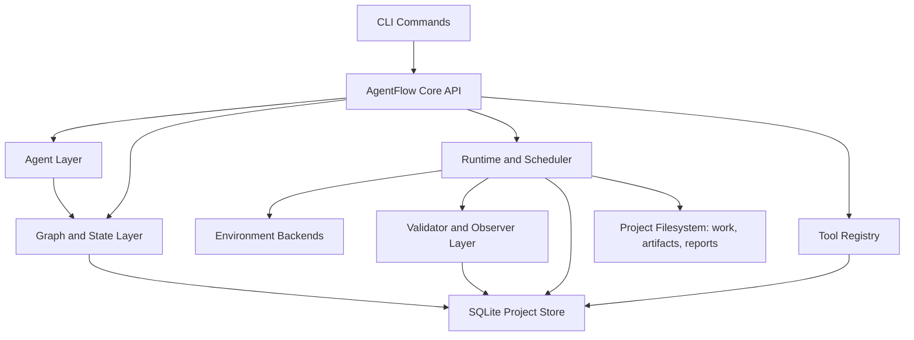

# AgentFlow Technical Design Document

Status: Draft for review
Owner: TBD
Last updated: 2026-05-28
Related document: `docs/agentflow-product-development.md`
MVP scope document: `docs/agentflow-v0-runtime-mvp-spec.md`

## 1. Document Purpose

This document turns the AgentFlow product thesis into an implementable technical plan.

It is written from two perspectives:

1. **Product management perspective**: what V1 must prove, what should be delayed, what risks could make the product misleading or too expensive to build.
2. **Technical research and development perspective**: what architecture, runtime model, storage model, APIs, upgrade strategy, and operational controls are needed for a maintainable product.

The key decision for V1:

> AgentFlow should build a small runnable workflow runtime of its own, while borrowing the best operational ideas from Nextflow: task graph, isolated work directories, environment declaration, cache/resume, retry, trace, status, and artifact publishing.

AgentFlow should not rebuild Nextflow's full DSL, channel system, HPC/cloud scheduler matrix, or ecosystem compatibility in V1.

This document describes the long-term technical direction. The first implementation scope is controlled by `docs/agentflow-v0-runtime-mvp-spec.md`.

## 2. Product and Engineering Goals

### Product Goals

V1 should let a researcher:

1. Create or import a project.
2. Register a small set of verified tools.
3. Start from raw or intermediate artifacts.
4. Generate a draft analysis graph.
5. Validate inputs before execution.
6. Execute real tasks.
7. Track status, logs, retries, environment, cache metadata, and outputs.
8. Validate and summarize outputs.
9. Record observations, negative evidence, and branch decisions.
10. Generate a report from the evidence graph.

V0 narrows this further to a deterministic CLI runtime: project init, tool registration, imported artifacts, local execution, status/logs, retry, cache metadata, artifact registration, and a basic report.

### Engineering Goals

V1 should give developers:

1. A stable domain model for steps, runs, artifacts, observations, decisions, and graph patches.
2. A project-local state store.
3. A deterministic runtime loop.
4. A small executor abstraction.
5. Tool schema validation before execution.
6. Versioned API contracts for CLI-first usage and future integrations.
7. Upgrade-safe database and spec migrations.
8. Clear boundaries between deterministic execution and Agent reasoning.

### Non-Goals for V1

V1 should not attempt:

- Full Nextflow compatibility
- A new general-purpose workflow DSL
- Dynamic channel algebra
- HPC scheduling
- Kubernetes
- Multi-user collaboration
- Marketplace-scale tool distribution
- Fully autonomous scientific decision making
- Automatic publication-ready claims

## 3. Core Architecture

AgentFlow should be organized as a layered system.



### Layer Responsibilities

| Layer | Responsibility | V1 Scope |
| --- | --- | --- |
| CLI | User commands, status views, logs, approval actions | Required |
| Core API | Stable boundary for CLI and future integrations | Required |
| Agent Layer | Draft flow, explain failures, propose graph patches | Limited and approval-gated |
| Graph Layer | Goals, steps, edges, artifacts, observations, decisions | Required |
| Runtime Layer | Ready-step scheduling, execution, retry, cache lookup | Required |
| Environment Layer | Local process and Conda/micromamba execution | Local required; Conda/micromamba recommended |
| Tool Registry | Tool contracts and capabilities | Required |
| Validator Layer | Deterministic preflight/postflight checks | Required |
| Observer Layer | Structured summaries from outputs | Required for selected tools |
| Storage Layer | SQLite state and filesystem artifacts | Required |

### Architecture Decision: Independent First, Omiga-Ready

AgentFlow should be developed as an independent CLI-first project first, not as code embedded directly inside Omiga.

The correct boundary is:

```text
agentflow-core      runtime, graph, state, tools, validation, execution
agentflow-cli       standalone terminal interface
agentflow-schemas   versioned JSON/YAML contracts
omiga-adapter       later integration layer for Omiga
```

Omiga should integrate with AgentFlow only after the core runtime is useful on its own.

Allowed integration paths:

1. Omiga calls `agentflow` CLI commands and consumes stable JSON output.
2. Omiga embeds `agentflow-core` as a library after the core API stabilizes.
3. Omiga reads public artifact manifests, reports, and exported graph JSON.

Not allowed in the V1 foundation:

- `agentflow-core` importing Omiga code.
- Runtime behavior depending on Omiga UI state.
- Tool execution logic living only in Omiga-specific handlers.
- AgentFlow state stored only in an Omiga project database.
- Omiga treating internal SQLite tables as the stable public API.

Rationale:

- Independent CLI execution is faster to build and easier to test.
- Runtime correctness should not depend on UI readiness.
- Scientific project state remains portable.
- Omiga can later add visualization, interaction, project management, and review workflows without owning the execution model.
- A clean boundary prevents early frontend or desktop assumptions from leaking into the workflow runtime.

This does not require separate repositories. AgentFlow can live in a monorepo or alongside Omiga during development, but module boundaries must remain strict: core code must be usable without Omiga installed.

## 4. Recommended Technology Stack

### Core Runtime

Recommended:

- Rust for the core engine.
- Tokio for asynchronous process/log/status management.
- SQLite for project-local metadata.
- Serde for JSON/YAML schema serialization.
- Petgraph or an internal DAG implementation for graph traversal.
- SHA-256 hashing for artifacts and cache keys.
- Tracing-compatible structured logs.

Rationale:

- Rust is suitable for long-running local execution, process management, and reliable local project state.
- The runtime should be callable from CLI first, with a stable core API that future products can embed.
- Tokio gives the runtime async process/log handling and scheduling foundations.
- SQLite is appropriate for local-first project state if write access is serialized and backup/migration behavior is explicit.

### Command-Line Interface and Future Integration

Recommended:

- CLI first for V1 execution and testing.
- Machine-readable JSON output for status, graph, artifacts, observations, and reports.
- A stable internal core API so Omiga or another host application can integrate later.
- No frontend framework or desktop shell should be part of V1 technical selection.

Rationale:

- CLI-first reduces product risk: the runtime must work before visual workflow interaction matters.
- Terminal commands are faster to implement, easier to test, and easier to automate.
- Omiga integration should be a later adapter over stable AgentFlow commands/core APIs, not a driver of the initial architecture.
- Avoiding UI dependencies in V1 keeps the product focused on execution correctness, state management, validation, and reporting.

### Scientific Execution

Recommended V1 backend sequence:

1. Local process executor.
2. Existing Conda/micromamba environment executor.
3. Environment materialization from `environment.yml`.
4. Docker executor.
5. Singularity/Apptainer executor.
6. Nextflow/Snakemake import/export/adapter.

The first useful V1 should include local execution and at least a declared Conda/micromamba path, because scientific tools often depend on Python/R package stacks. Full automated environment solving can be introduced after the runtime state model is stable.

## 5. Borrowed Workflow Concepts

AgentFlow should borrow operational concepts from mature workflow engines without inheriting their full complexity.

### Borrow

- Task graph
- Ready-step scheduling
- Per-task isolated work directory
- Input staging
- Command/script materialization
- Runtime declaration
- Environment snapshot
- Cache key
- Resume check
- Retry attempt
- Trace/status records
- Output publishing

### Do Not Rebuild in V1

- Nextflow DSL
- Channel operators
- Complex scatter/gather semantics
- Multi-executor HPC abstraction
- Full container orchestration
- Cloud cache
- Workflow marketplace

### Design Implication

The V1 runtime should be intentionally small:

1. Load project state.
2. Build DAG.
3. Find ready steps.
4. Validate inputs.
5. Check cache.
6. Prepare workdir.
7. Execute command.
8. Capture logs.
9. Validate outputs.
10. Register artifacts.
11. Generate observations.
12. Update graph state.

## 6. Project Filesystem Layout

Each AgentFlow project should own a hidden state directory.

```text
project/
  .agentflow/
    project.db
    project.toml
    tools/
      builtin/
      project/
    flows/
      draft/
      approved/
    work/
      2f/
        2f9c.../
          command.sh
          inputs.json
          params.json
          runtime.json
          env.json
          stdout.log
          stderr.log
          outputs.json
          observation.json
    artifacts/
      imported/
      computed/
      reports/
      figures/
      tables/
    cache/
      blobs/
    reports/
      report.md
      report.html
    logs/
      agentflow.log
```

### File Ownership Rules

1. `work/` is immutable after a run attempt finishes, except for explicit cleanup metadata.
2. `artifacts/` stores published outputs or stable references.
3. Imported artifacts are registered by reference unless the user requests copying.
4. Computed artifacts are content-hashed.
5. Reports are generated outputs, not source of truth.
6. SQLite is the source of truth for state; filesystem objects are validated by hash/path metadata.

## 7. Domain Model

### Core Entities

| Entity | Meaning |
| --- | --- |
| Project | A local research workspace |
| Goal | User scientific intent or hypothesis |
| Flow | A graph snapshot or approved execution plan |
| Step | A planned unit of work |
| Edge | Dependency or evidence relationship |
| Run | One execution attempt for a step |
| Artifact | Input or output file/object |
| Observation | Structured summary of an artifact/run |
| Decision | Why the graph continued, stopped, branched, or changed |
| Approval | User approval/rejection record |
| GraphPatch | Proposed graph mutation |
| Tool | Registered capability with schema/runtime |
| EnvironmentSnapshot | Runtime/environment identity |
| CacheEntry | Reusable execution record |
| Event | Append-only product/runtime event |

### Step Types

| Step Type | Description |
| --- | --- |
| `import` | Register existing artifact as graph root |
| `analysis` | Execute a registered scientific tool |
| `validation` | Run deterministic checks |
| `observation` | Summarize artifact/run output |
| `decision` | Record continue/stop/branch rationale |
| `report` | Generate report section or final report |
| `external` | Represent an imported external run |
| `manual` | User-supplied assertion or interpretation |

### Run States

Executable steps should use explicit states:

- `draft`
- `waiting_for_input`
- `ready`
- `waiting_for_approval`
- `queued`
- `running`
- `completed`
- `completed_with_warning`
- `failed`
- `stopped_negative`
- `skipped`
- `superseded`
- `cancelled`

Important distinction:

- `failed`: technical failure, missing input, invalid environment, command error, invalid output.
- `stopped_negative`: task executed successfully but produced meaningful negative scientific evidence.

## 8. SQLite Data Model

V1 can use SQLite with a normalized schema plus JSON columns for versioned payloads.

Recommended tables:

```text
schema_migrations
projects
goals
flows
steps
step_ports
edges
tools
tool_versions
tool_catalog_entries
tool_capabilities
artifacts
runs
run_attempts
environment_snapshots
cache_entries
observations
decisions
hypotheses
research_notes
research_sources
research_queries
research_hits
research_documents
citations
evidence_claims
graph_patches
approvals
reports
events
```

### Table Notes

`steps`

- `id`
- `flow_id`
- `tool_id`
- `type`
- `status`
- `reason`
- `params_json`
- `requires_approval`
- `created_by`
- `schema_version`

`runs`

- `id`
- `step_id`
- `status`
- `attempt`
- `workdir`
- `cache_key`
- `started_at`
- `ended_at`
- `exit_code`
- `stdout_path`
- `stderr_path`
- `error_class`
- `error_message`

`artifacts`

- `id`
- `kind`
- `type`
- `path`
- `hash`
- `size_bytes`
- `source_step_id`
- `source_run_id`
- `provenance_json`
- `validation_json`

`events`

- Append-only timeline for CLI status, future integration views, and debugging.
- Stores state transitions, approvals, run starts, run finishes, observation creation, graph patch proposals, and report generation.

`hypotheses`

- Stores explicit scientific claims under investigation.
- Links claims to goals, observations, decisions, reports, and graph branches.
- Tracks status, confidence, supporting evidence, contradictory evidence, and validation needs.

`research_notes`

- Stores Research Mode outputs.
- Records searched sources, candidate methods, rejected options, citations, implementation plans, and uncertainty.
- Prevents tool-gap investigation from disappearing into chat history.

`research_sources`

- Stores configured source definitions such as local catalog, project files, official documentation, GitHub, package index, PubMed, Europe PMC, OpenAlex, Crossref, Unpaywall, or user-provided PDFs.
- Records access policy, rate limit policy, and whether the source can provide metadata, abstracts, full text, or only links.

`research_queries`

- Stores generated search queries, filters, timestamps, source names, and result counts.
- Makes Research Mode reproducible and reviewable.

`research_hits`

- Stores search results before selection.
- Includes title, URL/DOI/PMID/PMCID when available, source, snippet, score, and access status.

`research_documents`

- Stores fetched metadata, abstracts, open-access full text, or user-provided document text.
- Records document hash, license/access status, retrieval time, and extraction quality.

`citations`

- Stores normalized citation metadata.
- Links evidence claims, research notes, tool catalog entries, and report statements back to sources.

`evidence_claims`

- Stores extracted claims with evidence grade, source span when available, contradiction status, and confidence.
- Prevents reports from mixing observed project evidence with literature-backed or speculative claims.

`tool_catalog_entries`

- Stores non-executable candidate tools, packages, repositories, pipelines, and methods.
- Used for discovery and ranking, not direct execution.
- Can include source URL, citation, license, supported input/output types, maturity notes, and install hints.

`tool_capabilities`

- Normalized searchable capabilities extracted from active tools and catalog entries.
- Lets AgentFlow search by capability, artifact type, domain, method family, and constraints without showing the Agent every raw tool spec.

### SQLite Operating Mode

Use SQLite carefully:

- Enable WAL mode for better interactive read/write behavior.
- Use one writer queue in the AgentFlow service.
- Store large logs and artifacts as files, not database blobs.
- Store log paths and byte offsets in SQLite.
- Provide `agentflow backup` using SQLite backup APIs or a controlled checkpoint/copy flow.
- Avoid placing the project database on unreliable network filesystems.

## 9. Tool Registry

The Tool Registry is the capability boundary between Agent reasoning and executable work.

Agents should select from registered tools. They should not invent shell commands for normal execution.

AgentFlow should separate executable tools from discoverable candidates.

| Layer | Executable | Purpose |
| --- | --- | --- |
| Active Tool Registry | Yes | Approved tools that can run through AgentFlow |
| Discovery Catalog | No | Searchable candidates, packages, repositories, pipelines, and papers |
| External Research | No | Online or literature search when local knowledge is insufficient |

The Agent should receive a ranked shortlist of relevant capabilities, not the entire universe of tools.

### Progressive Disclosure Model

Tool information should be revealed in layers.

| Level | Agent Sees | Purpose |
| --- | --- | --- |
| 0 | Capability summary | Decide what kind of method is needed |
| 1 | Tool family shortlist | Choose among method families |
| 2 | Candidate tool cards | Compare fit, maturity, inputs, outputs, runtime burden |
| 3 | Tool contract | Validate ports, params, runtime, validators, observers |
| 4 | Promotion plan | Decide whether to install, wrap, or implement |
| 5 | Raw docs/source/papers | Verify details only when needed |

Default behavior:

- Show at most 5-10 candidates to the Agent.
- Prefer active tools over catalog candidates.
- Prefer verified tools over wrapped or exploratory tools.
- Prefer lower environment burden when scientific fit is comparable.
- Include "why not selected" notes for close alternatives.
- Require explicit expansion before exposing raw documentation or large source snippets.

This keeps the Agent from drowning in tool metadata and makes tool choice easier to audit.

### Why Not Register Everything

Registering every known tool as executable would create practical problems:

- Too much noise for tool selection.
- Conflicting environments and versions.
- Unknown licenses and maintenance status.
- Security risk from unreviewed commands.
- False confidence that a tool is supported when it is only known by name.
- Slow planning and unstable recommendations.

The active registry should stay small and trustworthy. The catalog can be broad because it is read-only.

### Discovery Strategy

Tool discovery should follow this order:

1. Search active tools by capability and artifact type.
2. Search project-local tools and scripts.
3. Search the discovery catalog.
4. Search approved external sources.
5. Compare candidates.
6. Propose registration, wrapping, or implementation.
7. Request approval.
8. Promote into active registry only after validation.

The result should be a ranked candidate set with reasons:

- Why this tool fits.
- Required inputs and outputs.
- Runtime/environment burden.
- License and installation concerns.
- Evidence source.
- Known limitations.
- Maturity target: exploratory, wrapped, or verified.

### Tool Maturity Levels

| Level | Name | Allowed by Default | Description |
| --- | --- | --- | --- |
| 1 | Verified | Yes | Full schema, validators, observer, known failure modes |
| 2 | Wrapped | With approval for risky actions | Command wrapper, declared I/O, minimal validation |
| 3 | Exploratory | Approval required | Preserved command/logs, low-confidence, cannot overwrite data |

### Tool Spec Example

```yaml
schema_version: agentflow.tool.v1
name: marker_survival_scan
version: 0.1.0
domain: tumor_marker
maturity: verified
description: Evaluate marker expression and survival association.

inputs:
  expression:
    type: ExpressionMatrix
    required: true
  survival:
    type: SurvivalTable
    required: true

params:
  gene:
    type: string
    required: true
  method:
    type: enum
    values: [cox, logrank]
    default: cox

outputs:
  result_table:
    type: Table
    path: results/marker_survival.tsv
  plot:
    type: Figure
    path: figures/survival.png
  summary:
    type: JsonSummary
    path: summary.json

runtime:
  backend: conda
  runner: /opt/conda/bin/conda
  env_name: marker-analysis
  env_file: envs/marker-analysis.yml
  command:
    - python
    - tools/marker_survival_scan.py
    - --expression
    - "{{ inputs.expression.path }}"
    - --survival
    - "{{ inputs.survival.path }}"
    - --gene
    - "{{ params.gene }}"
    - --method
    - "{{ params.method }}"

validators:
  preflight:
    - expression_matrix_schema
    - survival_table_schema
    - gene_exists_in_expression
    - sample_id_consistency
  postflight:
    - output_exists
    - table_has_required_columns
    - image_readable

observer:
  name: marker_survival_observer
  output: summary.json
```

### Tool Registry Rules

1. Tool name plus version is immutable once used in a run.
2. Updating a tool creates a new `tool_version`.
3. Runtime declaration participates in cache key generation.
4. Command templates are rendered by the runtime, not by the Agent.
5. Tool specs must be validated before registration.
6. Project tools can override built-in tools only by explicit namespace.
7. Catalog entries cannot execute until promoted into the Active Tool Registry.
8. Promotion requires a tool spec, runtime declaration, input/output contract, and at least minimal validation.
9. Verified promotion requires tests, observer support, known failure modes, and report behavior.

### Tool Promotion Pipeline

```text
catalog_candidate
  -> selected_candidate
  -> installation_plan
  -> user_approval
  -> exploratory_tool
  -> wrapped_tool
  -> verified_tool
```

Promotion gates:

| Target | Required Evidence |
| --- | --- |
| `exploratory_tool` | Command, source, approval, sandbox rules, log capture |
| `wrapped_tool` | Declared inputs/outputs, runtime, minimal validators, example run |
| `verified_tool` | Tests, observer, known failure modes, report template, cache-safe behavior |

### Capability Index

The Agent should query capabilities, not raw tools.

Example capability query:

```json
{
  "domain": "fusion_detection",
  "input_artifacts": ["BAM", "reference_genome"],
  "desired_output": "FusionTable",
  "constraints": {
    "species": "human",
    "runtime": ["local", "conda"],
    "license": "open_source"
  }
}
```

Example ranked response:

```json
{
  "query_id": "capq_001",
  "candidates": [
    {
      "name": "arriba",
      "source": "catalog",
      "executable": false,
      "fit": "high",
      "reason": "Known RNA-seq fusion caller that accepts aligned reads and produces fusion candidates.",
      "promotion_required": "wrapped_tool"
    },
    {
      "name": "star_fusion",
      "source": "catalog",
      "executable": false,
      "fit": "medium",
      "reason": "Common fusion caller, but may require STAR-aligned inputs and extra reference preparation.",
      "promotion_required": "wrapped_tool"
    }
  ]
}
```

## 10. Flow Draft and Graph Model

Flow drafts should be human-readable, but the database graph is the source of truth once approved.

### Flow Draft Example

```yaml
schema_version: agentflow.flow.v1
goal: Evaluate whether EGFR is a tumor therapy marker.

steps:
  - id: import_expression
    type: import
    outputs:
      expression:
        artifact: expression_matrix

  - id: import_survival
    type: import
    outputs:
      survival:
        artifact: survival_table

  - id: test_gene
    type: analysis
    tool: marker_survival_scan@0.1.0
    needs: [import_expression, import_survival]
    reason: Test whether the requested gene supports the marker hypothesis.
    inputs:
      expression: import_expression.expression
      survival: import_survival.survival
    params:
      gene: EGFR
      method: cox
    outputs:
      result_table: egfr_survival_result
      plot: egfr_survival_plot
      summary: egfr_survival_summary
```

### Graph Rules

1. Every executable step must reference a registered tool.
2. Every input port must resolve to an artifact or upstream output.
3. Every output artifact must have a declared type.
4. Cycles are forbidden in executable dependency edges.
5. Evidence edges can point backward for explanation, but cannot create execution cycles.
6. Graph patches must pass validation before approval.

## 11. Runtime Execution Loop

### High-Level Loop

```text
load project
load approved flow
build DAG
find ready steps
for each ready step:
  run deterministic preflight
  compute cache key
  if cache hit and outputs valid:
    restore/register cached outputs
    record cached run
    continue
  create run attempt
  prepare workdir
  materialize command
  execute through runtime backend
  capture stdout/stderr/status
  run deterministic postflight
  register artifacts
  run observer
  save observations
  trigger conditional Agent hook if needed
  apply approved graph patches
repeat until no runnable steps remain
```

### Runtime Responsibilities

The runtime must manage:

- Step readiness
- Dependency resolution
- Workdir creation
- Input staging
- Command/script rendering
- Process start/stop
- Stdout/stderr capture
- Exit code handling
- Timeout handling
- Retry policy
- Cache lookup/write
- Output validation
- Artifact registration
- Event emission

### Scheduler V1

V1 scheduler should be conservative:

- Default concurrency: `1`
- Configurable max concurrency: project setting
- No dynamic scatter/gather in V1
- No remote queues in V1
- Ready-step polling or event-driven loop is acceptable
- Cancel should be cooperative first, force-kill second

This is enough for product validation and avoids accidentally becoming a distributed workflow platform too early.

## 12. Environment Management

### Runtime Backend Interface

Every backend should implement the same conceptual interface:

```text
prepare(step, run_context) -> prepared_command
run(prepared_command) -> run_result
capture_environment(step, run_context) -> environment_snapshot
cancel(run_id) -> cancellation_result
```

### Local Backend

V1 required.

Responsibilities:

- Run command in workdir.
- Set environment variables.
- Capture stdout/stderr.
- Capture exit code.
- Enforce timeout if configured.

Limitations:

- Reproducibility depends on host environment.
- Should be marked lower reproducibility than Conda/Docker.

### Conda or Micromamba Backend

V1 recommended.

Modes:

1. Use existing named environment.
2. Use existing prefix.
3. Prepare environment from `environment.yml`.

Recommended V1 behavior:

- Support existing env or prefix first.
- Require an explicit runner path such as `/opt/conda/bin/conda` or `/opt/homebrew/bin/micromamba` for deterministic execution.
- Execute with `conda run --no-capture-output` or `micromamba run` without shell interpolation.
- Support `agentflow env check <tool-ref>` to verify runner accessibility, environment selector metadata, declared env-file hashability, and a lightweight `run true` probe before a real analysis.
- Support `environment.yml` preparation behind an explicit `agentflow env prepare <tool-ref>` command.
- Support `agentflow env export <tool-ref>` to capture Conda/micromamba export text, export hash, and a conservative package-set diff against declared env-file dependencies.
- Record env file hash and resolved package export when available; treat full lockfile normalization and solver-aware version diffing as later hardening work.
- Do not auto-install dependencies during normal `run` unless the user approved env preparation.

### Docker Backend

Later V1.x or V2.

Requirements:

- Use image digest when possible, not only mutable tags.
- Bind mount workdir and selected input paths.
- Avoid privileged containers by default.
- Record image reference and digest.
- Capture container exit code.

### Singularity/Apptainer Backend

Later V2.

Useful for HPC environments, but not necessary for V1.

### Nextflow/Snakemake Backend

Later.

Should be treated as:

1. Importer of completed run traces and artifacts.
2. Export target for stabilized deterministic branches.
3. Optional adapter for a known external pipeline.

It should not own AgentFlow's primary state model.

## 13. Cache and Resume

### Cache Key Inputs

Cache key should include:

- AgentFlow engine cache schema version
- Tool name and version
- Tool spec hash
- Command template hash
- Rendered params hash
- Input artifact hashes
- Runtime backend
- Environment hash
- Relevant script hashes
- Declared resource-affecting settings if they change output

Example:

```text
sha256(
  engine_cache_schema_version
  + tool_name
  + tool_version
  + tool_spec_hash
  + command_template_hash
  + sorted_input_artifact_hashes
  + normalized_params_json
  + runtime_backend
  + environment_hash
)
```

### Cache Hit Policy

A cache hit is valid only when:

1. Cache key matches.
2. Previous run status is cacheable.
3. Expected outputs still exist.
4. Expected outputs pass validation.
5. Artifact hashes match stored metadata.

### Cache Miss Policy

A cache miss should record why:

- Input changed
- Params changed
- Tool version changed
- Runtime changed
- Environment changed
- Output missing
- Output invalid
- Cache disabled

This reason is important for user trust and debugging.

## 14. Validation and Observation

### Preflight Validation

Preflight should run before cache lookup where possible.

Checks:

- Required inputs exist.
- Input artifact type matches port type.
- File hash is known or computed.
- Sample IDs are compatible.
- Parameters match schema.
- Runtime backend is available.
- Environment is available or prepared.
- Output paths do not overwrite protected artifacts.

### Postflight Validation

Postflight runs after execution and before the step is marked completed.

Checks:

- Exit code acceptable.
- Expected outputs exist.
- Output types are readable.
- Required columns/fields exist.
- Output file sizes are nonzero unless empty output is scientifically meaningful.
- Artifact hashes computed.
- Observer summary exists or can be generated.

### Observation Layer

Observers convert outputs into structured evidence.

Example observation:

```json
{
  "schema_version": "agentflow.observation.v1",
  "step_id": "test_gene",
  "artifact_id": "egfr_survival_summary",
  "severity": "info",
  "summary": "EGFR is not significantly associated with survival in this cohort.",
  "signals": {
    "gene": "EGFR",
    "hazard_ratio": 1.08,
    "p_value": 0.31,
    "supports_original_hypothesis": false
  },
  "suggested_decisions": [
    {
      "type": "branch",
      "reason": "Original gene signal is weak; evaluate homologs and interacting genes."
    }
  ]
}
```

Observation should not require the Agent to parse raw large files.

## 15. Agent Layer

> **优先级注记（2026-05-30）**：本节关于**自治姿态**的保守表述（"should be constrained"、Approval Policy 默认审批、Research Mode propose-only）已被 [`agentflow-agent-control-layer-design.md`](agentflow-agent-control-layer-design.md) §1.5 **重定调**。冲突处以控制层文档为准：自动化科研推进、动态图、智能分支选择为默认自治主线。本节仍有效的部分是：**硬禁止清单**（不直接操作 DB/shell、不绕过 registry）、检索合规（Research Source / Literature Retrieval Policy）、防自欺与 Evidence Grade、Hypothesis Lifecycle（其中 `inconclusive` 需带 `InconclusiveKind{Provisional|Fundamental}`，见控制层 §4.4）。下方 Approval Policy 清单不再表示"默认等批"，而是控制层"统一动作表"中**需交接/需强制论证**的那批高代价动作。

The Agent Layer should be constrained.

### Agent Responsibilities

Allowed:

- Generate draft flow from user goal and tool registry.
- Explain failures using logs and validation summaries.
- Interpret structured observations.
- Propose graph patches.
- Propose report language.
- Recommend next branches.
- Research missing capabilities through approved sources.
- Propose tool wrapping or custom implementation plans when no suitable tool exists.
- Critique hypotheses against supporting and opposing evidence.

Not allowed:

- Directly mutate the database.
- Directly execute shell commands.
- Silently overwrite artifacts.
- Bypass tool registry.
- Promote exploratory commands to verified tools.
- Claim unsupported biological or statistical conclusions as established facts.

### Graph Patch Example

```json
{
  "schema_version": "agentflow.graph_patch.v1",
  "reason": "EGFR does not support the marker hypothesis, but ERBB-family genes are biologically related.",
  "requires_approval": true,
  "operations": [
    {
      "op": "add_step",
      "step": {
        "id": "test_erbb_family",
        "type": "analysis",
        "tool": "marker_family_scan@0.1.0",
        "reason": "Evaluate homologous or family-related genes after weak EGFR evidence.",
        "params": {
          "seed_gene": "EGFR",
          "family": "ERBB"
        }
      }
    },
    {
      "op": "add_edge",
      "from": "test_gene",
      "to": "test_erbb_family",
      "edge_type": "hypothesis_revision"
    }
  ]
}
```

### Approval Policy

Default policy:

- Auto-allow deterministic validation.
- Auto-allow observation records.
- Require approval for new analysis branches.
- Require approval for hypothesis changes.
- Require approval for exploratory tools.
- Require approval for environment creation.
- Forbid destructive actions unless explicitly confirmed.

### Knowledge Assumption

AgentFlow should not assume the Agent has complete or current scientific knowledge.

The system should treat Agent knowledge as one input among several:

- Tool Registry
- Project artifacts
- Run logs
- Validator results
- Observer summaries
- Trusted documentation
- Public repositories and packages
- Literature and method papers
- User domain knowledge

The Agent may reason over these sources, but it should not replace them.

### Research Mode

When a step cannot proceed because a method, tool, parameter, reference, or interpretation is missing, AgentFlow should enter Research Mode.

Research Mode is a structured workflow, not a free-form chat.

Recommended stages:

1. Define the precise problem.
2. Check the local Tool Registry.
3. Check project scripts, previous runs, and imported external runs.
4. Search official documentation and trusted package references.
5. Search public repositories or package indexes.
6. Search literature, reviews, and method papers.
7. Compare candidate methods.
8. Identify risks, assumptions, licenses, and maintenance burden.
9. Recommend one of:
   - use an existing registered tool
   - wrap an existing command/package
   - import an external pipeline result
   - write a new exploratory tool
   - stop because the request is currently unsupported
10. Request approval before installation, wrapping, or custom implementation.

Research Mode outputs should be stored as `research_notes` or `decision` records, not only as chat text.

### Research Source Architecture

Research Mode should use source adapters rather than ad hoc web browsing.

Conceptual interface:

```text
ResearchSource
  search(query, filters) -> research_hits
  fetch_metadata(hit) -> research_document
  fetch_abstract(hit) -> research_document
  fetch_full_text(hit) -> research_document | unavailable
  resolve_access(hit) -> access_status
```

Source categories:

| Category | Examples | Role |
| --- | --- | --- |
| Local project | Tool registry, catalog, project scripts, previous runs, uploaded PDFs | Highest trust for project-specific work |
| Official docs | Tool docs, package docs, standards docs | Tool usage and parameter verification |
| Code/package sources | GitHub, package indexes, releases | Tool discovery, maintenance and install assessment |
| Literature metadata | PubMed, Crossref, OpenAlex | Discovery, citation, abstract-level screening |
| Open-access full text | PubMed Central, Europe PMC, publisher OA pages | Full-text extraction when legally available |
| OA resolver | Unpaywall or equivalent | Find legal open-access copies |
| User-provided documents | PDFs, notes, institutional exports | Full text when public access is unavailable |

V1 can start with local project/catalog search and manually triggered web/literature sources. Automated broad web search should come after source policy, caching, and citation handling are stable.

### Literature Retrieval Policy

AgentFlow should be explicit about what it could actually access.

Access statuses:

- `metadata_only`
- `abstract_available`
- `open_access_full_text`
- `user_provided_full_text`
- `subscription_connector_full_text`
- `full_text_unavailable`
- `retrieval_failed`

Rules:

1. Never bypass paywalls or use unauthorized sources.
2. Never claim to have read full text when only metadata or abstract was available.
3. Use abstracts for discovery and triage, not strong final claims.
4. Require full text, user-provided PDF, or independent validation before implementing a complex method from a paper.
5. Mark abstract-only evidence as lower confidence in reports.
6. Store DOI, PMID, PMCID, URL, retrieval time, and access status with every citation.
7. If the best source is paywalled, ask the user to provide a PDF or approve a configured institutional/subscription connector.

### Literature Search Workflow

Recommended workflow:

1. Turn the problem into explicit research questions.
2. Generate multiple query variants with synonyms and method names.
3. Search metadata/abstract indexes.
4. Deduplicate by DOI/PMID/title.
5. Resolve open-access full text where possible.
6. Extract claims only from accessible text.
7. Separate method claims from biological claims.
8. Search for contradictory or comparative papers.
9. Grade evidence by access level and source quality.
10. Store the research session and citations.
11. Produce a recommendation with uncertainty and next validation steps.

### Full-Text Limitation Strategy

The realistic solution is not to "solve" subscription barriers inside AgentFlow.

The solution is to make access limitations visible and actionable:

- Prefer open-access full text when available.
- Use user-provided PDFs as first-class research artifacts.
- Allow later optional connectors to institutional libraries, Zotero-like local libraries, or user browser sessions.
- Fall back to abstract/metadata with an explicit warning.
- Do not generate method implementations from inaccessible details.
- Do not make biological claims that depend on unread full text.
- Suggest alternative open-access sources, reviews, documentation, or reproducible tool repositories.

This means Research Mode can still make progress without pretending omniscience.

### Tool Gap Resolution

A missing tool should produce an explicit decision path.

```text
capability_needed
  -> registry_match?
  -> project_script_match?
  -> external_tool_candidate?
  -> literature_supported_method?
  -> implementation_plan?
  -> user_approval?
  -> exploratory_tool
  -> wrapped_tool
  -> verified_tool
```

Custom code is allowed only after the system records:

- Why existing registered tools are insufficient.
- Which external tools or repositories were considered.
- What literature or documentation supports the method.
- What assumptions the implementation makes.
- What tests or fixture data will validate the implementation.
- What maturity level the new tool receives.

New code should enter as `exploratory` or `wrapped`, not `verified`.

> **实现注记（2026-06-03）**：本节正由控制层里程碑 **S1/S2** 落地（见 `status/s1-tool-synthesis-plan.md`、`status/s2-grade-cap-plan.md`）。
> - S1 `agentflow synth`：LLM 写候选代码 → 在隔离 workdir 用 **fixture/已知答案验证** → 仅通过才注册，且**一律 `exploratory`**（对应本节"tests/fixture data validate"+"enter as exploratory, not verified"）。
> - S2：exploratory 工具的证据 grade 封顶（`Observed`→`Inferred`），使其无法独立驱动 `affirmed`——把"低信任"做成机制。
> - **尚未实现**：本节的完整决策痕迹记录（why insufficient / external candidates considered / literature support / assumptions）与 `user_approval` 闸门、以及 `exploratory→wrapped→verified` 晋升流水线——计划随 S3（循环遇能力缺口→raise 合成决策点）补齐。

### Hypothesis Lifecycle

Scientific hypotheses should be first-class objects, not hidden prose.

Recommended states:

- `proposed`
- `under_test`
- `supported`
- `weakened`
- `contradicted`
- `inconclusive`
- `superseded`

Each hypothesis should track:

- Statement
- Origin
- Related goal
- Supporting observations
- Contradictory observations
- Confidence level
- Required validation
- Downstream decisions

Example:

```json
{
  "schema_version": "agentflow.hypothesis.v1",
  "id": "hyp_egfr_marker",
  "statement": "EGFR is a viable tumor therapy marker in this cohort.",
  "status": "weakened",
  "supporting_observations": [],
  "contradictory_observations": ["obs_egfr_survival_not_significant"],
  "confidence": "low",
  "required_validation": [
    "Check cohort size and tumor subtype distribution",
    "Evaluate ERBB-family homologs",
    "Cross-validate in external cohort"
  ]
}
```

### Anti-Self-Deception Protocol

AgentFlow should make it difficult for the Agent to tell a plausible but unsupported story.

Before a hypothesis shift, branch recommendation, or report conclusion is accepted, the Agent should answer:

1. What evidence supports this?
2. What evidence argues against this?
3. What alternative explanations exist?
4. What data quality issues could explain the result?
5. What assumptions are being made?
6. What would falsify this hypothesis?
7. Is this conclusion directly observed, statistically inferred, or speculative?
8. What should not be claimed yet?

The output should include an evidence grade:

| Grade | Meaning |
| --- | --- |
| `observed` | Directly supported by validated artifact or run output |
| `inferred` | Reasonable interpretation from observed data |
| `literature_supported` | Supported by cited external sources but not proven in project data |
| `hypothesis` | Plausible but unvalidated |
| `unsupported` | Insufficient evidence; should not drive action |

Reports must distinguish these grades.

### Dialectical Reasoning Protocol

For important decisions, AgentFlow should require a lightweight critique pass.

Decision types that need critique:

- Change original hypothesis.
- Create a major new branch.
- Stop a branch as negative evidence.
- Recommend a candidate biomarker.
- Select a new unregistered tool.
- Write custom code for a scientific method.

Critique should check:

- Is the conclusion overfitted to the current result?
- Is there a simpler explanation?
- Are there batch, sample, annotation, or cohort confounders?
- Are there missing controls?
- Does the literature support or contradict the proposed interpretation?
- Is the next step experimentally or computationally testable?

The goal is not to make the Agent indecisive. The goal is to force the system to separate evidence, interpretation, uncertainty, and action.

## 16. Public Interfaces

AgentFlow should expose a core API that is used by the CLI first and can be embedded by future integrations.

### Service Interfaces

```text
ProjectService
  init_project(path, options)
  open_project(path)
  doctor(project_id)
  backup(project_id)

ToolRegistryService
  register_tool(spec)
  validate_tool(spec)
  list_tools(filters)
  inspect_tool(tool_ref)
  search_capabilities(query)
  promote_catalog_entry(entry_id, target_maturity)

ToolCatalogService
  import_catalog(source)
  search_catalog(query)
  inspect_catalog_entry(entry_id)
  compare_catalog_entries(entry_ids)
  create_promotion_plan(entry_id)

ArtifactService
  import_artifact(path, type, metadata)
  validate_artifact(artifact_id)
  list_artifacts(filters)
  inspect_artifact(artifact_id)

FlowService
  create_draft(goal, inputs)
  validate_flow(flow_id)
  approve_flow(flow_id)
  export_flow(flow_id, format)

RunService
  run_step(step_id, options)
  run_flow(flow_id, options)
  cancel_run(run_id)
  retry_step(step_id)
  get_status(scope)
  tail_logs(run_id, stream, offset)

ObservationService
  observe_artifact(artifact_id)
  list_observations(filters)

AgentService
  propose_flow(goal, context)
  propose_patch(step_id, observation_id)
  explain_failure(run_id)
  critique_hypothesis(hypothesis_id)

ResearchService
  research_problem(problem_statement, context)
  research_tool_gap(capability, constraints)
  compare_methods(method_refs)
  propose_tool_wrap(candidate_tool)
  search_literature(query, filters)
  resolve_full_text(citation_id)
  import_research_document(path, metadata)
  extract_evidence_claims(document_id)

HypothesisService
  create_hypothesis(statement, origin)
  update_hypothesis_status(hypothesis_id, status, evidence)
  list_hypotheses(filters)
  inspect_hypothesis(hypothesis_id)
  challenge_hypothesis(hypothesis_id)

ReportService
  generate_report(flow_id, options)
  export_report(report_id, format)
```

### CLI Commands

Recommended V1 CLI:

```text
agentflow init
agentflow doctor
agentflow tools list
agentflow tools register <tool.yaml>
agentflow tools validate <tool.yaml>
agentflow tools search "<capability>"
agentflow tools promote <catalog-entry-id> --target exploratory
agentflow catalog import <source>
agentflow catalog search "<capability>"
agentflow catalog inspect <entry-id>
agentflow catalog compare <entry-a> <entry-b>
agentflow import <path> --type <type>
agentflow draft --goal <goal.txt>
agentflow flow validate <flow-id>
agentflow flow approve <flow-id>
agentflow run <flow-id>
agentflow run-step <step-id>
agentflow status
agentflow logs <run-id>
agentflow retry <step-id>
agentflow observe <artifact-id>
agentflow patch list
agentflow patch approve <patch-id>
agentflow research "<problem>"
agentflow research tool-gap "<capability>"
agentflow research compare <method-a> <method-b>
agentflow research literature "<query>"
agentflow research resolve-fulltext <citation-id>
agentflow research import-pdf <path>
agentflow research claims <document-id>
agentflow hypotheses list
agentflow hypotheses inspect <hypothesis-id>
agentflow hypotheses challenge <hypothesis-id>
agentflow report generate <flow-id>
agentflow env prepare <tool-ref>
agentflow env export <tool-ref>
agentflow cache list
agentflow cache explain <step-id>
agentflow cleanup --work --cache
agentflow backup
```

### Machine-Readable CLI Output

Every command that may be consumed by Omiga or another host application should support structured output.

Recommended convention:

```text
agentflow status --json
agentflow graph export --format json
agentflow artifacts list --json
agentflow observations list --json
agentflow catalog search "<capability>" --json
agentflow research literature "<query>" --json
agentflow research claims <document-id> --json
agentflow report generate <flow-id> --format markdown
agentflow report generate <flow-id> --format json
```

Rules:

1. Human-readable output is optimized for terminal use.
2. JSON output is versioned and stable.
3. JSON output should avoid terminal formatting, colors, or progress spinners.
4. Long-running commands should emit events in a machine-readable mode when requested.

### Future Omiga Integration Boundary

Omiga integration should come after the CLI runtime is useful.

The future integration should depend on:

- Stable CLI commands
- Stable JSON output
- Stable SQLite/project schema
- Stable core API if AgentFlow is embedded as a library

The initial AgentFlow technical selection should not include a desktop shell, graph UI framework, or Omiga-specific frontend code. Those choices belong to the Omiga integration phase.

SQLite is an internal storage implementation. Omiga integration should depend on stable CLI JSON output, exported graph/report/artifact manifests, or a future library API, not on direct reads of internal database tables.

## 17. Versioning and Compatibility

### Versioned Contracts

Every persistent format should include `schema_version`:

- Tool spec
- Flow draft
- Graph patch
- Observation
- Report manifest
- Cache entry
- Environment snapshot

### Compatibility Policy

Recommended:

- Patch versions: backward compatible bug fixes.
- Minor versions: additive fields only.
- Major versions: breaking schema changes require migration.
- Unknown fields should be preserved when possible.
- Required unknown fields should fail validation.

### Database Migrations

Rules:

1. Migration scripts are forward-only.
2. Project backup is created before major migration.
3. Each migration records engine version, timestamp, and checksum.
4. Failed migration leaves the original project recoverable.
5. Clients should block opening a newer unsupported project database.

### Tool Compatibility

When a tool spec changes:

- Old runs remain tied to the old tool version.
- Cache keys change.
- Reports should display the actual tool version used.
- A deprecated tool can remain runnable if its runtime still exists.

### Artifact Compatibility

Artifact records should include:

- logical type
- format version when known
- path
- hash
- source run
- validation summary

This allows new observers to re-read old artifacts without rewriting provenance.

## 18. Operations and Management Efficiency

### Runtime Efficiency

Design choices:

- Keep large files out of SQLite.
- Store logs as files with offsets.
- Store structured summaries in SQLite.
- Hash files once and reuse hashes unless size/mtime changed.
- Avoid scanning all project files during every command.
- Use event records to update status views incrementally.
- Default to sequential execution to reduce resource surprises.

### Project Doctor

`agentflow doctor` should check:

- SQLite schema version
- Missing work directories
- Missing artifacts
- Hash mismatches
- Broken tool specs
- Missing runtime binaries
- Missing Conda/micromamba envs
- Stale cache entries
- Orphaned runs
- Oversized logs/cache/workdirs

### Cleanup

Cleanup should be explicit and reversible when possible:

- Remove failed workdirs older than a threshold.
- Prune cache entries not referenced by current flows.
- Archive old logs.
- Never delete imported source artifacts by default.
- Never delete published artifacts without confirmation.

### Backup

Backup should include:

- SQLite database
- project config
- tool specs
- flow specs
- reports
- artifact manifests

Large artifacts can be copied, referenced, or skipped depending on backup mode.

Backup modes:

- `metadata-only`
- `metadata-and-reports`
- `full-project`

## 19. Security and Safety

### Command Safety

Rules:

1. Verified tools use structured command templates.
2. Agent-generated shell is not allowed in verified execution.
3. Exploratory commands require approval and clear labeling.
4. Output paths must be inside approved project locations unless explicitly allowed.
5. Commands must not overwrite imported source artifacts.

### Environment Safety

Rules:

- Environment creation requires approval.
- Docker privileged mode is forbidden by default.
- Bind mounts are restricted to project and approved input paths.
- Network access policy should be explicit for tools that upload/query data.
- Secrets must not be included in reports or Agent prompts.

### Data Privacy

Scientific data may include sensitive human data.

V1 should:

- Avoid sending raw datasets to LLMs.
- Send structured summaries instead of full files.
- Allow local-only mode.
- Redact paths/tokens/secrets from logs shown to Agent.
- Record whether an Agent call used local or remote model infrastructure.

## 20. Testing Strategy

### Unit Tests

Cover:

- Tool spec validation
- Flow validation
- DAG cycle detection
- Port resolution
- Cache key generation
- State transitions
- Graph patch validation
- Migration functions

### Integration Tests

Cover:

- Local executor success
- Local executor failure
- Retry behavior
- Cache hit and cache miss
- Missing output postflight failure
- Imported artifact root
- Report generation from observations

### Golden Tests

Use fixed fixtures for:

- Tool YAML
- Flow YAML
- Observation JSON
- Graph patch JSON
- Report Markdown

### Failure Injection

Test:

- Command exits nonzero.
- Command times out.
- Output missing.
- Output malformed.
- Cache entry exists but output file missing.
- Environment missing.
- Project database migration interrupted.

### Product Acceptance Test

V1 should pass one end-to-end scenario:

1. Initialize project.
2. Register marker-analysis tools.
3. Import expression and survival tables.
4. Create flow draft from goal.
5. Approve flow.
6. Run analysis.
7. Generate observation showing weak original marker evidence.
8. Propose homolog/interacting-gene branch.
9. Approve branch.
10. Run branch.
11. Generate report with original hypothesis, negative evidence, new candidate evidence, and branch rationale.

## 21. Release Plan

The release plan below is a long-term staged roadmap. The immediate implementation target is the narrower V0 scope in `docs/agentflow-v0-runtime-mvp-spec.md`.

### V0.1: Minimal Runtime Skeleton

Deliver:

- Project init/open
- SQLite state
- Tool registry
- Flow validation
- DAG scheduler
- Local executor
- Workdir/log/status
- Artifact registration

Exit criteria:

- Can run a two-step local flow and inspect status/logs/artifacts.
- Does not include discovery catalog, Research Mode, Omiga adapter, Docker, Nextflow, or parallel execution.

### V0.2: Validation and Cache

Deliver:

- Preflight validators
- Postflight validators
- Cache key generation
- Cache hit/miss explanation
- Retry support
- Imported artifact roots

Exit criteria:

- Can resume a completed step only when outputs are valid.

### V0.3: Conda/Micromamba and Observers

Deliver:

- Existing env/prefix execution
- Optional env preparation command
- Observer summaries
- Structured observations

Exit criteria:

- Can run at least one real Python/R scientific tool in a managed environment.

### V0.4: Agent Patch and Approval

Deliver:

- Agent draft flow
- Agent failure explanation
- Agent graph patch proposal
- Approval/rejection workflow
- Hypothesis records
- Anti-self-deception critique prompts for major decisions

Exit criteria:

- Agent can propose a branch from an observation, but cannot execute it without approval.
- Agent can distinguish observed evidence, inference, literature-supported claims, hypotheses, and unsupported claims.

### V0.5: Research Mode and Tool Gap Handling

Deliver:

- Research Mode records
- Tool gap workflow
- Method comparison records
- Candidate tool wrapping proposal
- Custom implementation proposal template
- Catalog candidate promotion workflow

Exit criteria:

- When a needed capability is missing, AgentFlow can produce a reviewable research record before proposing installation, wrapping, or new code.
- A catalog candidate can be promoted to an exploratory tool only through an approved plan.

### V0.6: Report and Integration Boundary

Deliver:

- Markdown/HTML report generation
- Machine-readable graph export
- Machine-readable status/report/artifact output
- Stable integration contract for future Omiga use

Exit criteria:

- Researcher can review the causal path without reading raw logs.

### V1.0: First Runnable Product

Deliver:

- One supported domain scenario
- Stable CLI/API
- Local plus Conda/micromamba execution
- Evidence graph
- Research Mode for missing capabilities
- Hypothesis critique and evidence grading
- Reports
- Upgrade-safe schema
- Basic cleanup/doctor/backup

Exit criteria:

- A real user can complete one meaningful analysis story from imported artifacts to final evidence report.

## 22. Open Technical Decisions

1. Should the first implementation expose CLI only, or CLI plus a Rust library API from the start?
2. Should V1 use `rusqlite` for simpler embedded SQLite control or `sqlx` for compile-time query checking?
3. Should flow drafts be YAML-first, JSON-first, or stored only in SQLite after validation?
4. Should Conda/micromamba environment preparation be included in V1.0 or V0.3?
5. What is the first domain-specific tool set: marker discovery, bulk RNA-seq, scRNA, or fusion analysis?
6. How strict should cache validation be for huge files where full hashing is expensive?
7. Which artifact types need built-in validators first?
8. What model provider policy is acceptable for sensitive biomedical data?
9. What minimal machine-readable output does Omiga need after the CLI runtime is stable?
10. Which external research sources are allowed by default: official docs, GitHub, package indexes, PubMed, Europe PMC, arXiv/bioRxiv?
11. What citation and evidence grade format is required before a report can make a biological claim?
12. When should custom tool implementation be allowed instead of stopping and asking the user?
13. Should V1 support user-provided PDF import for literature, or only metadata/abstract search?
14. Which sources should be bundled as default source adapters, and which should require explicit user configuration?
15. How should AgentFlow handle papers where only the abstract is accessible but the method details are in the paywalled full text?

## 23. Recommended Immediate Next Steps

1. Decide first domain scenario.
2. Choose the V1 runtime baseline: local-only or local plus Conda/micromamba.
3. Freeze V1 entity names and state machine.
4. Define the active registry vs discovery catalog boundary.
5. Write schema files for tool spec, catalog entry, flow draft, graph patch, observation, and report manifest.
6. Implement project-local SQLite schema.
7. Implement CLI-first runtime skeleton.
8. Build one tiny verified tool and one real scientific wrapped tool.
9. Define Research Mode source policy and evidence grading.
10. Define the literature access policy and PDF import behavior.
11. Run the end-to-end acceptance test.

## 24. Reference Notes

These external references informed the technical direction:

- Nextflow caching/resume and work directory model: https://docs.seqera.io/nextflow/cache-and-resume
- SQLite WAL behavior and operational caveats: https://www.sqlite.org/wal.html
- Conda `environment.yml` specification: https://conda.org/learn/specifications/exchange/environment-yml/
- Docker container execution and image references: https://docs.docker.com/engine/containers/run/
- Tokio runtime overview: https://tokio.rs/
- NCBI E-utilities for PubMed/PMC metadata access: https://www.ncbi.nlm.nih.gov/books/NBK25501/
- PubMed Central Open Access subset: https://www.ncbi.nlm.nih.gov/pmc/tools/openftlist/
- Europe PMC REST API and full-text links: https://europepmc.org/RestfulWebService
- OpenAlex API for scholarly metadata and open-access metadata: https://docs.openalex.org/
- Unpaywall API for legal open-access copy resolution: https://unpaywall.org/products/api
